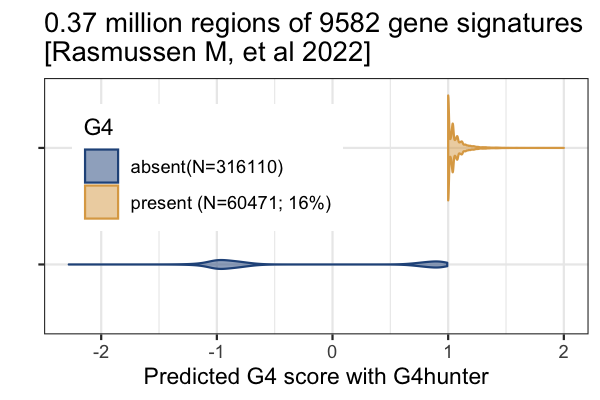

# Identification of G4 Propensity in the predictive or DE genes cf-RNA during normal/disease status of pregnancy

## Methodology
G4 propensity for a given gene was predicted using the G4Hunter algorithm which was developed for chromosome level estimation of G4 regions in DNA. We repurpose the algorithm for a gene and its all transcripts harboring exons only using Bioconductor packages from mapping gene symbol to ENTREZID to Transcript features to their exon level features. The exon features were merged to transcript features andits correspinding sequence. Using this G4Hunter algorithm was applied and all the predicted G4 regions and G4Score (G4 propensity) was estimated for all the regions. As suggested by the authors of G4Hunter, G4Score of greater than or equals to 1 were annotated as G4 for the genes differentially expressed or predictors of gestational age based on cell-free RNA (cfRNA)
   
## Cell-Free RNA data
- cfRNA dataset 1, Rasmussen M. et al, 2022 [RNA profiles reveal signatures of future health and disease in pregnancy](https://www.nature.com/articles/s41586-021-04249-w)
- cfRNA dataset 2, Moufarrej MN. et al 2022 [Early prediction of preeclampsia in pregnancy with cell-free RNA](https://www.nature.com/articles/s41586-022-04410-z) 

## Insights
15.5 % harbors G4 (absent=21141; present=3880) of the 588 gene
signatures based on machine learning model  associated with future
health and disease in pregnancy [Rasmussen M, et al 2022 cfRNA data]

[Figure 2A](fig/2A-g4-propensity-scores-within-trans-cfRNA-preterm-preclamp.png)
[Figure 2B](fig/2B-g4-propensity-and-G4-counts-per-trans-cfRNA-preterm-preclamp.png)
[R code](./g4hunter-map-ga-preeclamsia-cfrna.R)

16.05 % harbors G4 (absent=316110; present=60471) of the 
9582 gene signatures associated with future health and disease in pregnancy [Rasmussen M, et al 2022 cfRNA data] [R code](./g4hunter-ga-24h-adult-fetal.R)

16.68% G4 (absent=2922; present=585) in the DE set of cfRNA from 
early prediction of preclampsia [Moufarrej MN. et al 2022]

[Figure 4A](fig/4A-g4-propensity-scores-within-trans-cfRNA-preclamp.png)

[Figure 4B](fig/4B-g4-propensity-and-G4-counts-per-trans-cfRNA-preclamp.png)
[R code](./g4hunter-pre.R)

